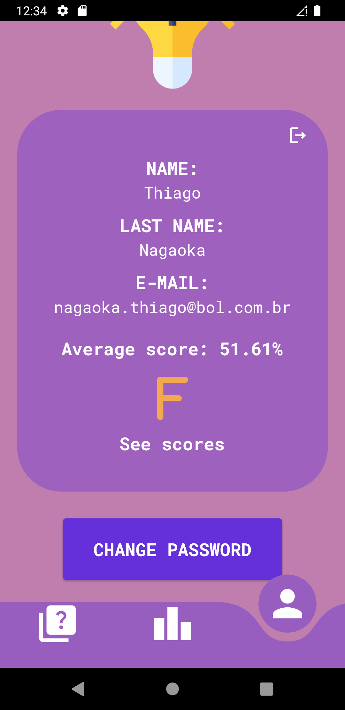

# Quiz Snowman App

This project was proposed on a training course organized by Snowman Labs. Its main purpose is to allow users to do quizes, see their scores on previous quizes and, if the number of correct answers is high enough, see if this is on top of the leaderboard. This app consumes a public API, its url is: https://the-trivia-api.com/.

It was developed by Rodolfo Bittar Kunzel and Thiago Nagaoka.

You need to login on our app, to do it you need to register first, and then use it to login. The login and registration pages are illustrated bellow.

<div style="display: flex;">
&nbsp;&nbsp;

</div>

After you are logged in, you will be redirected to our home page. Our menu is placed in the bottom of the screen, the first option is a page where you can select the categories, difficulty level and number of questions that you want to answer on the quiz. This screen can be seen on the image bellow.


If you select the option in the middle of the bottom menu, you will see the leaderboard. This screen is shown in the image bellow.


If you select the last option, you will see user's information. this is illustrated in the first image bellow. If you click 'CHANGE PASSWORD', you can change your password. It is shown in the second image bellow.

<div style="display: flex;">
&nbsp;&nbsp;

</div>

If you click 'See scores', you can see your scoreboard. It is illustrated in the image below.


If you click 'CREATE QUIZ' in the first screen of home page, you will be redirected to the questions of the quiz as seen in the first image bellow. You can see that there is a timer. If you select an incorrect option, this option will be shown as red and the correct answer will be shown as green. This situation is shown in the second image bellow.

<div style="display: flex;">
&nbsp;&nbsp;

</div>

If you click on the correct answer, this option will be shown as green, as seen in the first image bellow. If the timer is up, the correct answer will be shown as a light green, but it won't be computed. It is shown in the second image bellow.

<div style="display: flex;">
&nbsp;&nbsp;

</div>

## Getting Started

If you would like to collaborate or just run this app on your computer, remember that you need to have this items on your Desktop:

- Dart
- Flutter
- Visual Studio Code
- Android Studio
- XCode (MacOS)

And then you need to run the following command in your terminal:

```
git clone https://github.com/nagaoka-thiago/quiz_snowman_app.git
```